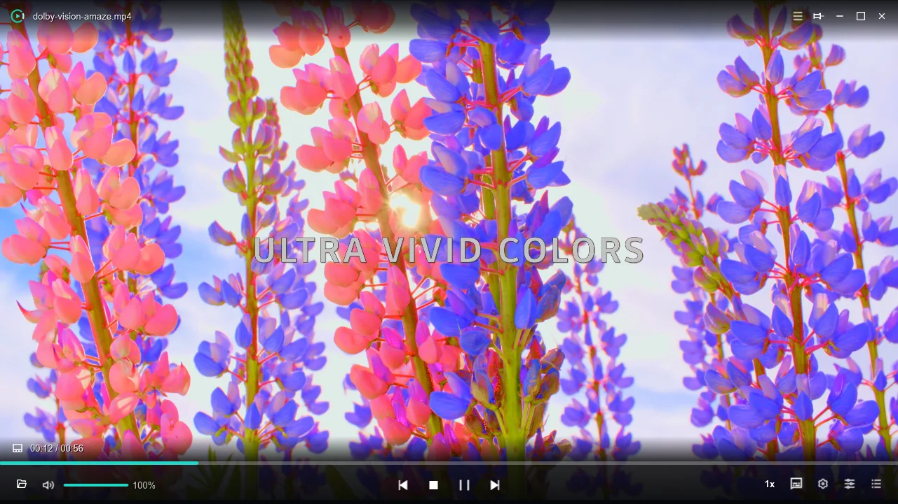

## Technical Background

HDR and Dolby Vision contain rich 10-bit color data and dynamic metadata. When played directly on standard SDR displays, colors can appear washed out.

## Tone Mapping Engine

Kyna Player provides real-time GPU hardware tone mapping:

### Highlights

1. **Accurate Color Preservation**: Maintains natural skin tones and contrast.
2. **Zero Latency**: Pure GPU pipeline rendering even for 4K 60fps videos.
